# Chain Lens

A Bitcoin transaction and block analyzer with a Rust-powered CLI and a rich React web visualizer. Chain Lens parses raw Bitcoin data, classifies scripts and addresses, computes fees, and presents everything with interactive diagrams and plain-English explanations — designed so even non-technical users can understand what a transaction does.

[](https://classroom.github.com/a/BdrW_bK5)

---

## Table of Contents

- [Features](#features)
- [Screenshots](#screenshots)
- [Getting Started](#getting-started)
- [CLI Usage](#cli-usage)
- [Web Visualizer](#web-visualizer)
- [Architecture](#architecture)
- [Tech Stack](#tech-stack)

---

## Features

### Transaction Analysis
- **Full transaction parsing** — decodes raw hex into structured JSON with txid, wtxid, version, locktime, sizes, weights, and fees.
- **Script classification** — identifies P2PKH, P2SH, P2WPKH, P2WSH, P2TR, OP_RETURN, and nested SegWit types on both inputs and outputs.
- **Address derivation** — computes Base58Check (legacy), Bech32 (SegWit v0), and Bech32m (Taproot) mainnet addresses.
- **Script disassembly** — renders scriptSig and scriptPubKey as human-readable ASM with proper opcode names.
- **OP_RETURN decoding** — extracts payload hex, attempts UTF-8 decoding, and detects known protocols (Omni, OpenTimestamps).
- **SegWit savings analysis** — shows actual vs. hypothetical legacy weight with a savings percentage.
- **Timelock detection** — parses absolute locktimes (block height / unix timestamp) and per-input BIP68 relative timelocks.
- **RBF signaling** — detects BIP125 replace-by-fee from nSequence values.
- **Warnings** — flags high fees, dust outputs, unknown scripts, and RBF signaling.

### Block Analysis
- **Bitcoin Core `.dat` file parsing** — reads `blk*.dat`, `rev*.dat`, and `xor.dat` directly, with XOR decoding.
- **Undo data parsing** — recovers prevouts from Bitcoin Core's undo records, including compressed script types.
- **Merkle root verification** — computes and validates the merkle root from parsed transactions.
- **Coinbase extraction** — identifies the coinbase transaction and decodes BIP34 block height.
- **Block statistics** — total fees, total weight, average fee rate, and script type distribution across all outputs.

### Web Visualizer
- **Transaction flow diagram** — SVG Sankey-style visualization showing inputs → fee → outputs with proportional line thickness.
- **Story narrative** — plain-English "What happened?" walkthrough of any transaction.
- **Stats dashboard** — fee, fee rate (with bucket labels like Economy/Priority), virtual size, weight, efficiency.
- **Collapsible input/output panels** — address, value, script type badges, timelock info, witness stack viewer, highlighted ASM.
- **Block dashboard** — block header summary, coinbase reward breakdown (subsidy vs. fees), fee rate histogram, script type distribution chart, interactive merkle tree, BIP9 version bits grid, SegWit adoption stats, intra-block spend detection.
- **Transaction comparison** — load two transactions side-by-side and compare across 17 metrics with color-coded indicators.
- **ELI5 tooltips everywhere** — every technical term has a plain-English explanation plus a "Details for nerds" section.
- **Dark / Light / System theme** with smooth switching and localStorage persistence.
- **Export** — copy JSON to clipboard or download as a file.
- **Fully offline** — no external blockchain API required; works entirely from raw hex data or local files.

---

## Screenshots

| Figure | Description |
|--------|-------------|
| 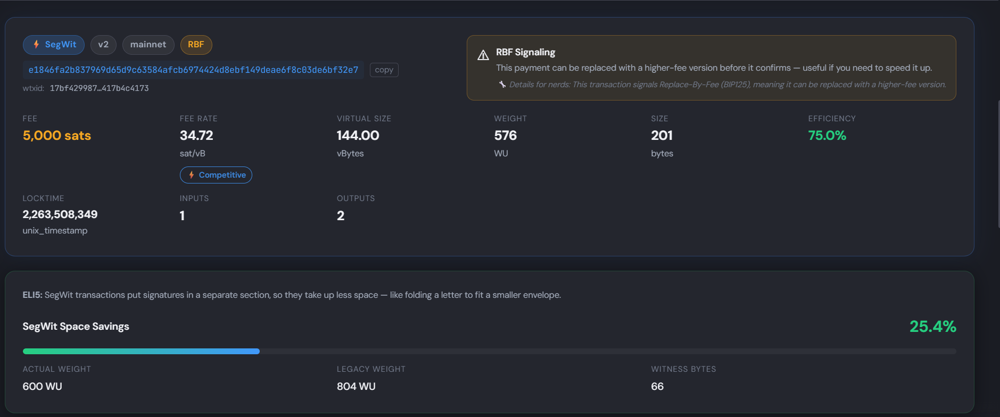 | **Figure 1** — Transaction loader with raw hex and fixture input modes |
| 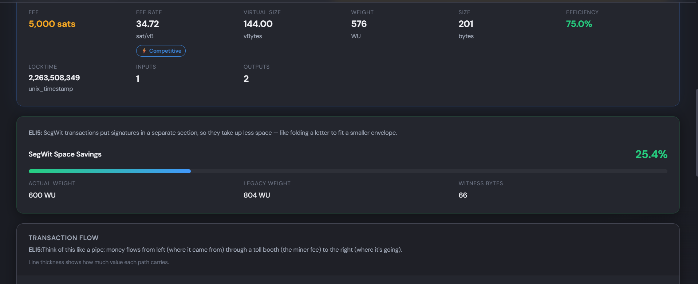 | **Figure 2** — Transaction analysis story narrative |
| 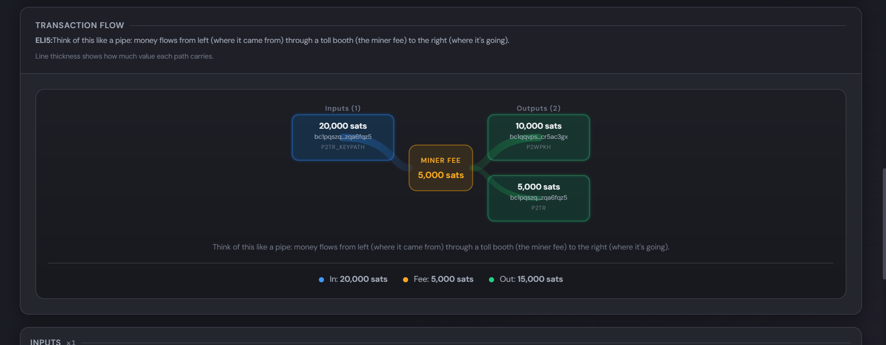 | **Figure 3** — Transaction flow diagram (inputs → outputs) |
| 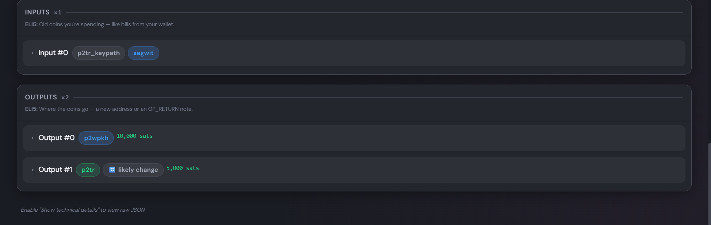 | **Figure 4** — Transaction stats dashboard |
| 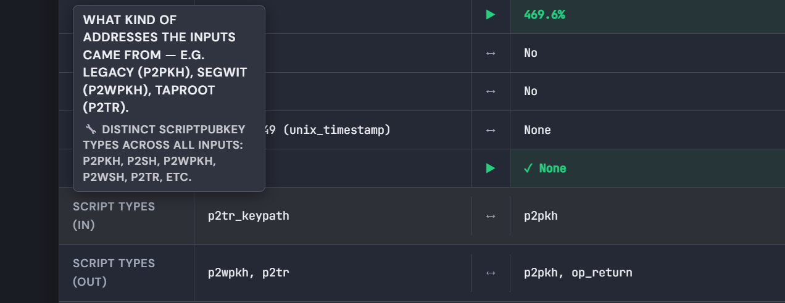 | **Figure 5** — SegWit savings visualization |
| 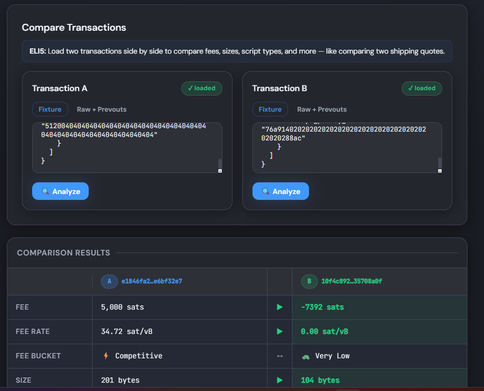 | **Figure 6** — Input/output detail panels |
| 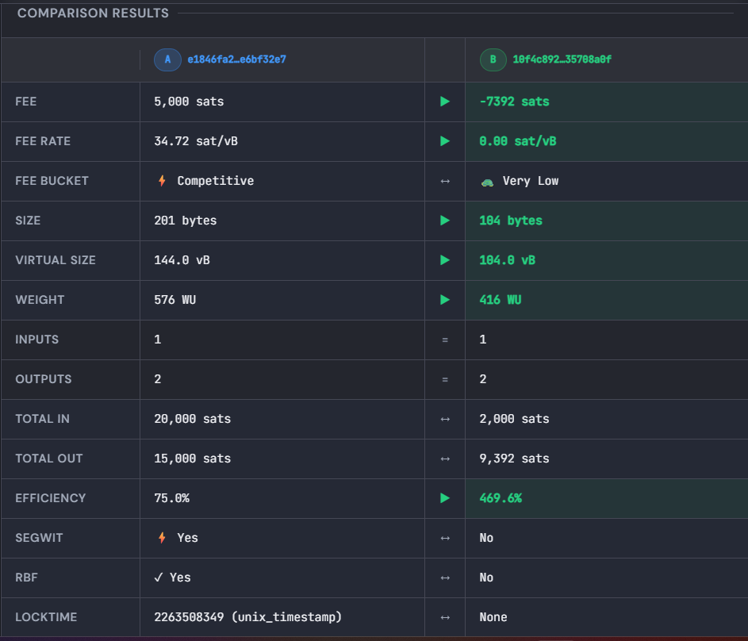 | **Figure 7** — Block analysis overview |
| 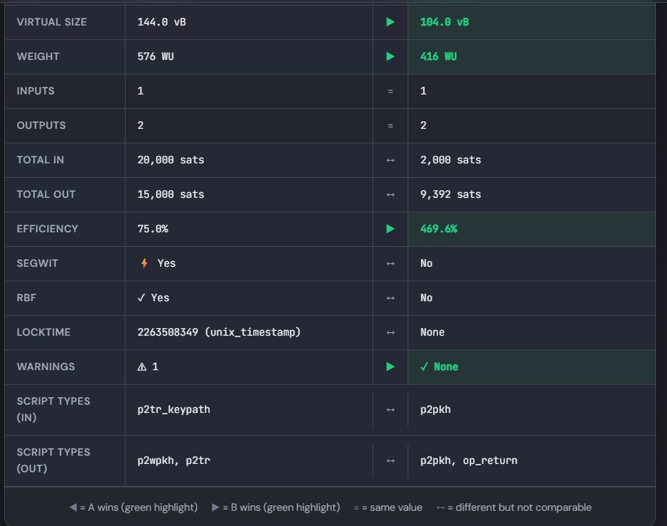 | **Figure 8** — Block header and coinbase details |
| 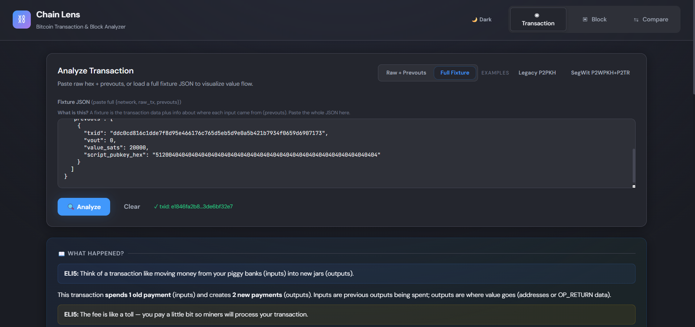 | **Figure 9** — Fee rate histogram and script type distribution |
| 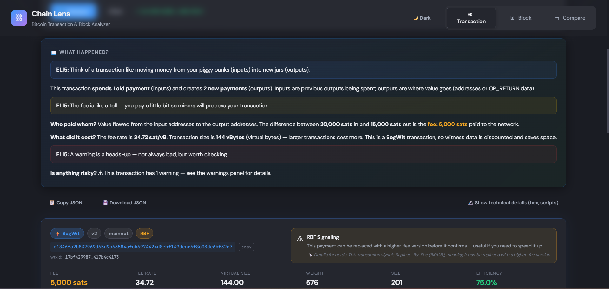 | **Figure 10** — Merkle tree visualization |
| 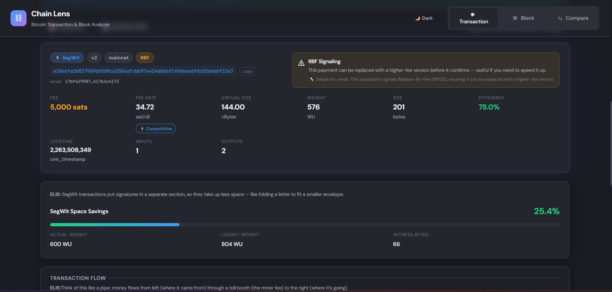 | **Figure 11** — BIP9 version bits grid |
| 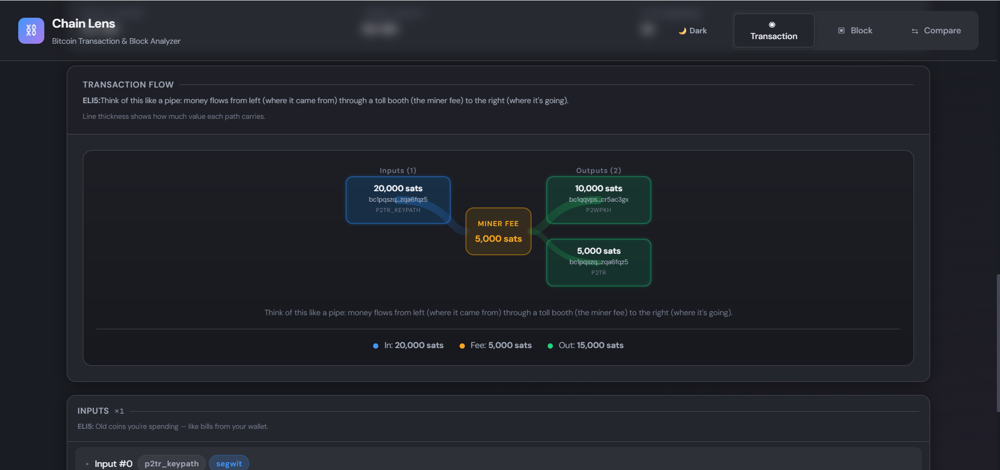 | **Figure 12** — Transaction comparison view |
| 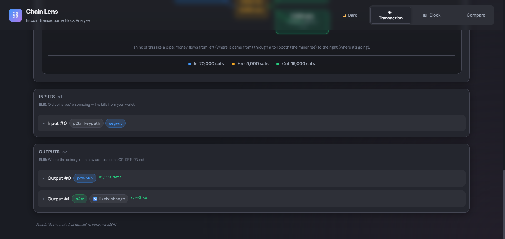 | **Figure 13** — Warnings and risk alerts |
| 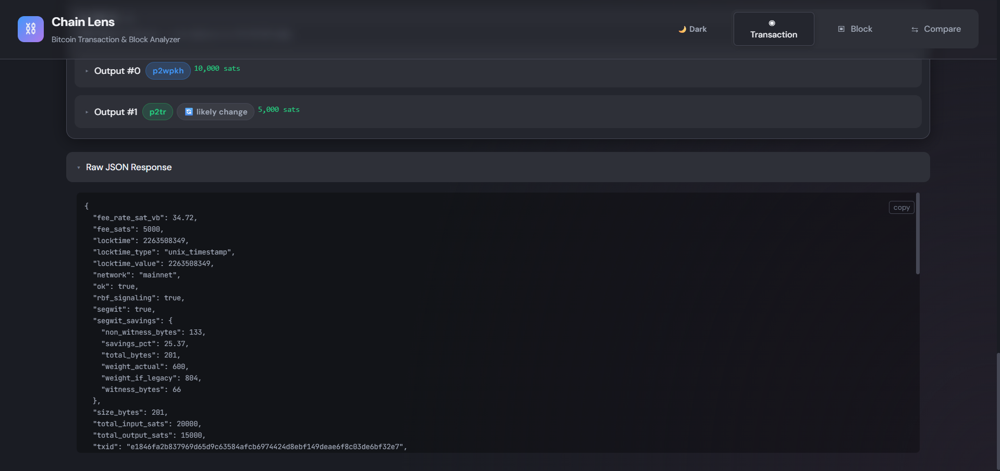 | **Figure 14** — Dark and light theme variants |

---

## Getting Started

### Prerequisites

- **Rust** (stable toolchain)
- **Node.js** (for the web frontend)

### Setup

```bash
./setup.sh
```

This decompresses any block fixtures needed for testing.

### Build

```bash
# Build the Rust CLI (release mode)
cargo build --release -p chain-lens-core

# Build the web frontend
cd web && npm install && npm run build
```

---

## CLI Usage

### Transaction mode

Analyze a single transaction from a fixture JSON file:

```bash
./cli.sh fixtures/transactions/tx_legacy_p2pkh.json
```

The fixture contains `raw_tx` (hex) and `prevouts` (the spent outputs). The CLI writes a detailed JSON report to `out/<txid>.json` and prints it to stdout.

### Block mode

Analyze an entire block from Bitcoin Core data files:

```bash
./cli.sh --block <blk*.dat> <rev*.dat> <xor.dat>
```

Writes a JSON report for each block to `out/<block_hash>.json`.

### Error handling

On any failure (malformed data, missing prevouts, etc.), the CLI outputs structured JSON and exits with code `1`:

```json
{ "ok": false, "error": { "code": "INVALID_TX", "message": "..." } }
```

---

## Web Visualizer

Start the web server:

```bash
./web.sh
```

Opens at `http://127.0.0.1:3000` (honors the `PORT` environment variable).

### API Endpoints

| Endpoint | Method | Description |
|----------|--------|-------------|
| `/api/health` | GET | Health check — returns `{ "ok": true }` |
| `/api/analyze` | POST | Analyze a transaction (JSON body with `raw_tx` + `prevouts`) |
| `/api/analyze-block` | POST | Analyze a block (multipart upload of `.dat` files) |

### Tabs

- **Transaction** — paste raw hex + prevouts, or a full fixture JSON. Click "Analyze" to see the full breakdown.
- **Block** — upload or paste `blk*.dat`, `rev*.dat`, and `xor.dat` files to explore an entire block.
- **Compare** — load two transactions side-by-side and compare fees, sizes, efficiency, and more.

---

## Architecture

```
chain-lens-core/       Rust library + CLI binary
├── parser.rs          Raw transaction byte parsing
├── classify.rs        Script type classification & address derivation
├── disasm.rs          Script disassembly to ASM
├── accounting.rs      Fee & value accounting
├── segwit.rs          SegWit savings analysis
├── timelock.rs        Absolute & relative timelock detection
├── op_return.rs       OP_RETURN payload decoding
├── warnings.rs        Warning generation
├── block_parser.rs    Block header & transaction parsing from .dat files
├── undo.rs            Bitcoin Core undo data parsing
├── xor.rs             XOR key decoding
├── merkle.rs          Merkle root computation & verification
└── main.rs            CLI entry point

chain-lens-server/     Axum HTTP server
└── main.rs            REST API + static file serving

web/                   React/TypeScript frontend (Vite)
├── App.tsx            Main shell with tab navigation & theme switcher
├── TransactionLoader  Input forms for raw hex / fixture JSON
├── TransactionVisualizer  Full transaction breakdown with story mode
├── TransactionFlowDiagram  SVG Sankey-style value flow
├── BlockVisualizer    Block dashboard with merkle tree, histograms, version bits
└── TransactionComparison  Side-by-side transaction comparison
```

---

## Tech Stack

- **Backend:** Rust, Axum, Serde, sha2, bech32, bs58
- **Frontend:** React 18, TypeScript, Vite
- **Styling:** Custom CSS with design tokens, dark/light themes

